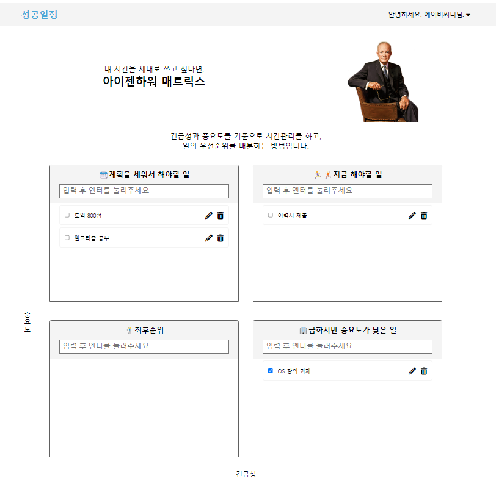

# 새싹(SeSAC)에서 진행한 프로젝트 기록

[새싹 홈페이지](https://sesac.seoul.kr/common/greeting.do)

 

> 폴더 안내

### sesac_project   
ㄴScheduleOfSuccess : 성공일정   

ㄴSchedule_Manage_Web: 성공일정 데모 버전  

 

## 1. [성공일정]: 일정 관리 웹 사이트 

### AWS와 MYSQL, nodejs를 이용한 일정 관리 웹 서비스 구축

- 회원가입과 로그인을 통해 자기만의 일정을 관리할 수 있다.
- 중요도와 긴급도에 따라 일정을 추가하고, 수정, 삭제할 수 있다.

[프로젝트 강의 링크: 웹 풀스택 기술로 일정관리 서비스 만들기](https://sesac.seoul.kr/course/active/detail.do?courseActiveSeq=1417&srchCategoryTypeCd=&courseMasterSeq=234&currentMenuId=900001001)

